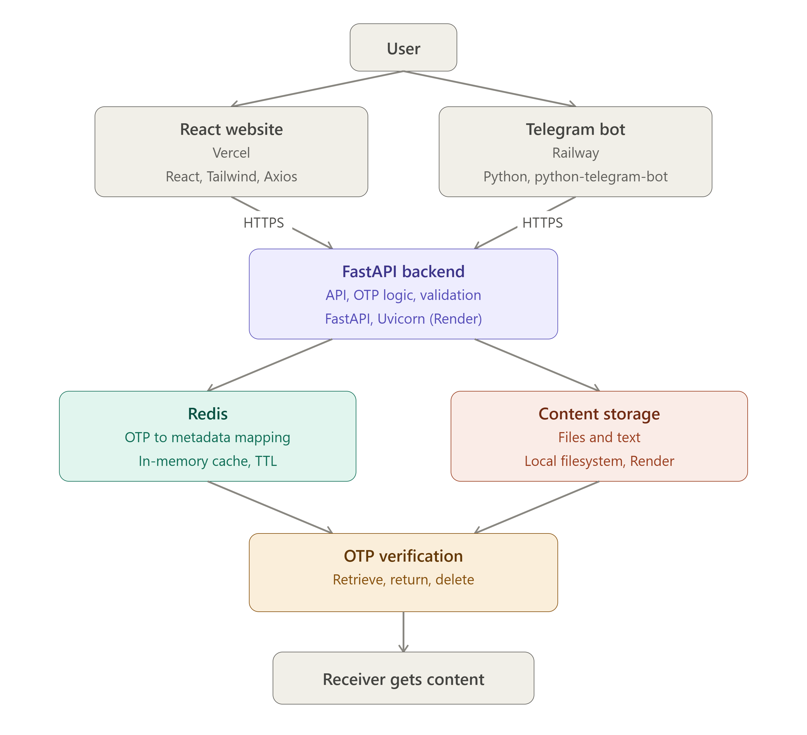
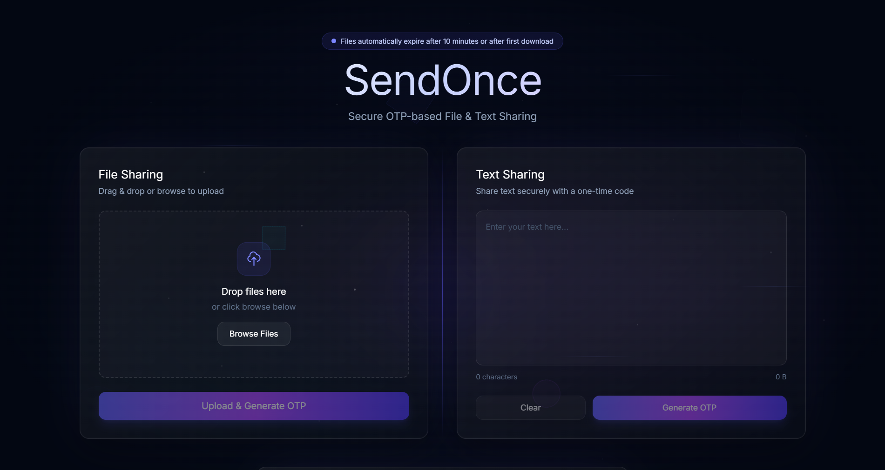
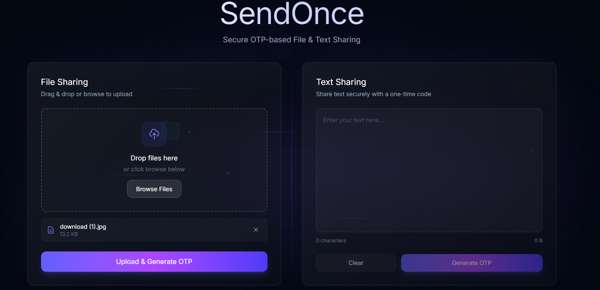
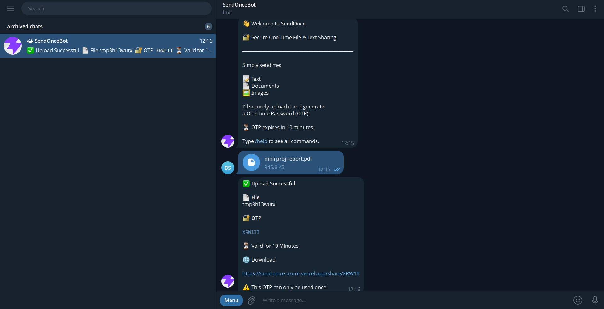
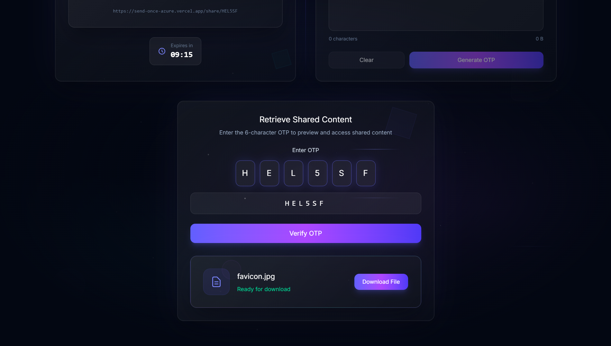

# 🚀 SendOnce

**Secure OTP-based File & Text Sharing Platform**

SendOnce allows users to securely share text or files using a one-time password (OTP). Once the OTP is used, the content becomes inaccessible, ensuring one-time access for improved privacy.

## 🌐 Live Demo

- **Website:** https://send-once-azure.vercel.app
- **Telegram Bot:** https://t.me/sendonce_bot

---

## ✨ Features

- 🔐 One-Time Password (OTP) based sharing
- 📄 Share text securely
- 📁 Share files securely
- 🤖 Telegram Bot integration
- 🌐 Responsive web interface
- ⚡ FastAPI backend
- ☁️ Fully deployed cloud architecture
- 🗑️ One-time access (OTP expires after use)
- ❌ User-friendly error handling

---

## 🏗️ Architecture

<p align="center">
  
</p>

---

## 🛠️ Tech Stack

### Frontend
- React
- Tailwind CSS
- Axios

### Backend
- FastAPI
- Python

### Telegram Bot
- python-telegram-bot

### Deployment
- Vercel
- Render
- Railway

---

## 📂 Project Structure

```
SendOnce/
│
├── frontend/
├── backend/
├── telegram_bot/
└── README.md
```

---

## ⚙️ Installation

### Clone

```bash
git clone https://github.com/yourusername/SendOnce.git
cd SendOnce
```

### Backend

```bash
cd backend
pip install -r requirements.txt
uvicorn main:app --reload
```

### Telegram Bot

```bash
cd telegram_bot
pip install -r requirements.txt
python main.py
```

### Frontend

```bash
cd frontend
npm install
npm run dev
```

---

## 🔑 Environment Variables

### Backend

```
API_KEY=
UPLOAD_FOLDER=
```

### Telegram Bot

```
BOT_TOKEN=
API_URL=
```

---

## 📸 Screenshots

Add screenshots here:

- Home Page
<p align="center">
  
</p>

- Upload Page
<p align="center">
  
</p>
- Generated OTP
<p align="center">
  
</p>
- Telegram Bot
<p align="center">
  
</p>
- Download Screen
<p align="center">
  
</p>


---

## 🎯 Future Improvements

- Rate limiting
- File expiration
- Automatic cleanup scheduler
- Drag-and-drop uploads
- Download analytics
- End-to-end encryption
- Admin dashboard

---


## 📄 License

This project is licensed under the MIT License.
